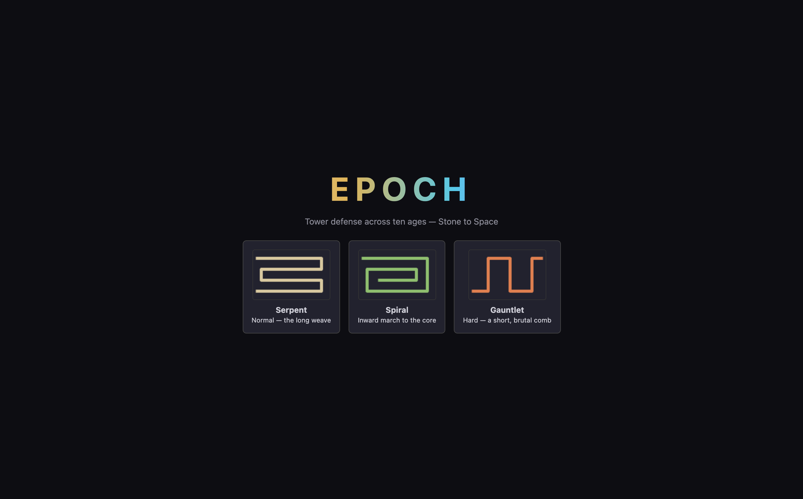
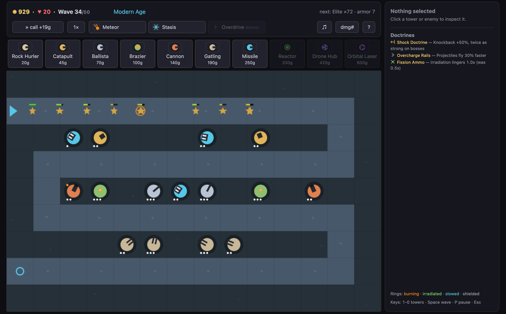
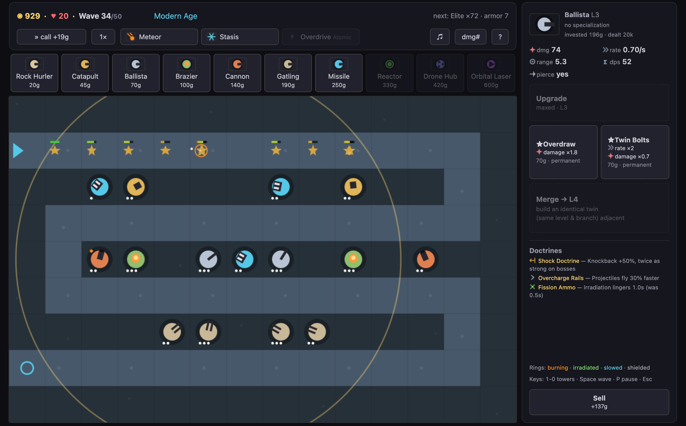
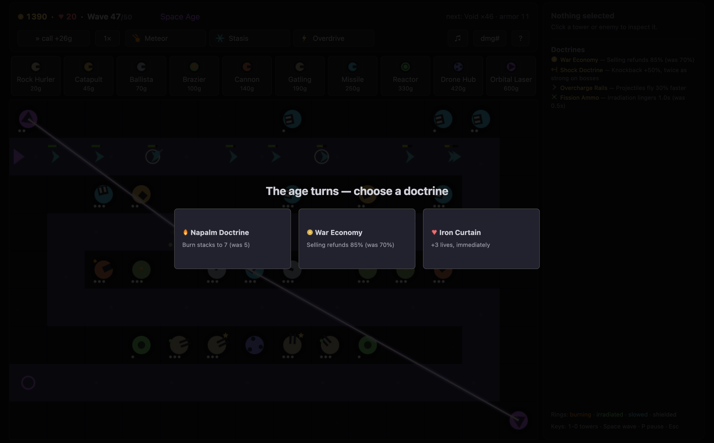
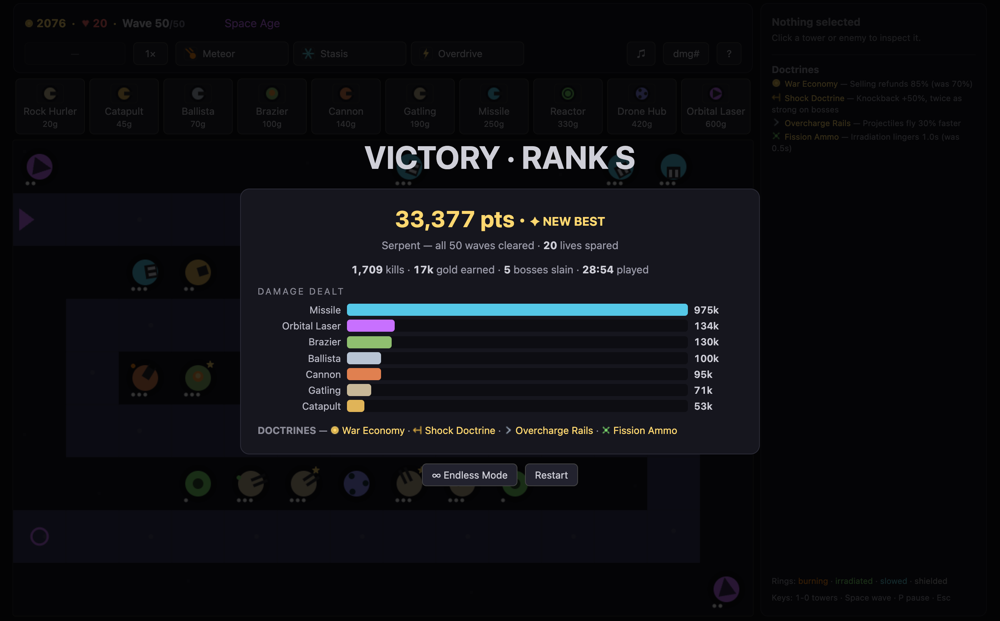

# EPOCH

Tower defense from the Stone Age to the Space Age, in a single HTML file. No dependencies, no build step, no image or audio files. Open it in a browser and play.

**[▶ Play it now](https://okturan.github.io/epoch-td/)** — runs in the browser, nothing to install.

[](https://github.com/okturan/epoch-td/actions/workflows/ci.yml)



## Run it

Play the [hosted version](https://okturan.github.io/epoch-td/), or download `index.html` and double-click it. Either way is the whole install. It runs offline and makes zero network requests. The file is about 62 KB.

Pick one of three maps, then defend the path across 50 waves. You start with 80 gold and 20 lives. Enemies follow a fixed route, you place towers on the open cells, and every leak costs a life (a boss leak costs five). Survive all 50 to win. After that, Endless mode keeps the waves coming until something gets through.



## One tower per age

The game spans ten ages, and each one unlocks a single new tower that does something the previous nine could not:

| Age | Tower | New mechanic |
|-----|-------|-------------|
| Stone | Rock Hurler | single-target shot |
| Bronze | Catapult | splash |
| Iron | Ballista | ignores armor |
| Medieval | Brazier | burning damage over time |
| Gunpowder | Cannon | knockback |
| Industrial | Gatling | fire rate that ramps on a held target |
| Modern | Missile Battery | homing shots that pick the healthiest enemy |
| Atomic | Reactor | damage aura that also makes enemies take more damage |
| Information | Drone Hub | slows enemies and speeds up its neighbors |
| Space | Orbital Laser | infinite-range beam that ramps the longer it holds |

Enemies scale to match. The ten archetypes (runners, armored, regenerators, splitters, shielded, tanks, dashers, and the rest) each counter a different tower, so a board that beat wave 20 will not beat wave 40 without new answers. The last stretch is tuned to need the Reactor, the Drone Hub, and a ramped Laser at the same time. You cannot stack one tower and coast.

## More than placement

You don't just drop a tower and leave it.

- **Upgrade** it three levels for more damage, range, and projectile speed.
- **Specialize** at level 3 down one of two permanent branches. The Ballista turns into either a heavy single-shot or a double-firing rapid version.
- **Merge** two identical adjacent towers into a level 4, then a level 5. Drag one onto the other, or pick a direction. No gold is lost and each merge adds 10% damage.
- **Fuse** certain neighbors into something the shop never sells. A Catapult next to a Brazier can become a Meteor Thrower. There are six of these recipes and the game does not tell you what they are.



Where you build matters too. Anything next to a Brazier fires burning ammo, next to a Reactor it fires radioactive ammo, next to a Drone Hub it fires faster. Burning plus radioactive hits harder than either alone.

## Doctrines, powerups, and a score

Every time a boss falls, the game pauses and offers three doctrines. You keep one for the rest of the run: +1 gold per kill, 85% sell refunds, cheaper upgrades, bigger knockback, and so on. Four picks from a pool of twelve, so two runs rarely feel the same.



Three powerups unlock as the ages pass: a meteor strike you aim, a freeze, and a fire-rate burst. They run on cooldowns and cost no gold.

When a run ends you get a score, a rank from C to S, a damage breakdown by tower, and your best result per map is saved.



## Under the hood

Everything is generated at runtime. Tower and enemy shapes are drawn on a canvas. The music and every sound effect are synthesized with the Web Audio API. There are no asset files because there are no assets.

The code is one `index.html`, 871 lines. It follows a strict rule: one `Tower` class, one `Enemy` class, one `update()` loop, and every mechanic is a field that loop reads instead of a new class. Adding knockback or burning ammo was a few numbers and one `if`, not a subsystem.

## The balance is checked, not guessed

`update(state, dt)` is a pure function with no canvas or DOM reads, so the whole game can run without a browser. `sim.js` does that: it plays all 50 waves at full speed with scripted builds and checks a set of rules on every change to the numbers.

- The intended counter-play composition clears wave 50 with at least 5 lives.
- A cheap "budget" build dies around wave 30, the first-loss target for a casual run.
- A "greedy" build that pours upgrades into a few towers dies on a rush wave, because stacking is meant to be punished.
- No non-boss wave takes longer than 90 seconds.
- The Space-age waves are unwinnable without the Orbital Laser, which proves the composition requirement is real and not decoration.

Run it yourself:

```
node sim.js
```

It needs nothing but Node. `endless.js` runs the same engine past wave 50 to find where an optimized build gives out (around wave 77 for the scripted one). The browser side has a Playwright suite in `qa.js` that drives real clicks through every feature, and `screenshot.js` produced the images above.

Run the complete deterministic and browser verification from a clean checkout:

```sh
npm ci
npx playwright install chromium
npm test
```

Both harnesses return a failing exit status when any declared balance or browser-interaction check fails. The pinned GitHub Actions workflow runs that same contract on every pull request and default-branch change.

## Files

- `index.html` — the game. The only file you need to play.
- `DESIGN.md` — the full spec: every tower stat, wave formula, doctrine, and fusion recipe.
- `sim.js`, `endless.js` — the headless balance harness. Node, no dependencies.
- `qa.js`, `screenshot.js` — browser tests and screenshots. These need Playwright (`npm install`).

## Notes

Built for desktop, so there is no touch or mobile layout. Best scores live in your browser's local storage and do not travel with the file. Balance is verified on the Serpent map; the other two are checked by an auto-placement bot rather than a full reference build.

## License

MIT. See [LICENSE](LICENSE).
